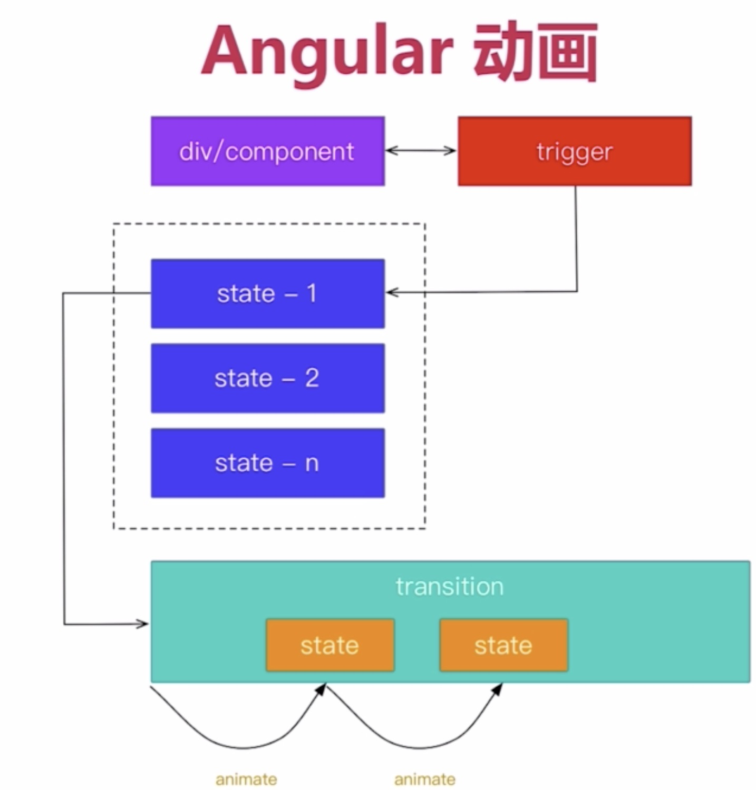

# angular 动画
动画原理
 
 
 
 # State和Transition
 State定义状态，Transition定义如何过渡
 
 #Animate函数
 规定了具体怎样过渡，比如时间，过渡速度
 
 #例子
 ts 
` animations: [`
         `trigger('square', [`
            ` state('green', style({'background-color': 'green'})),`
            ` state('red', style({'background-color': 'red'})),`
             `transition('green => red', animate(5000)),`
            ` transition('red => green', animate('1s 1s'))`
            `transition('red => green', animate('1s 1s ease-in', keyframes([
                             style({transform: 'translateX(30%)'}),
                             style({transform: 'translateX(80%)'}),
                             style({transform: 'translateX(10%)'}),
                         ])))`
         `])`
`]`

`onclick() {
       this.squareState = this.squareState === 'red' ? 'green' : 'red';
     }`
     
  
 
 html
  
` 

`
     
     
     
     
 #路由动画和高阶动画
 
     路由动画需要在host元数据中指定触发器
     

**Group**

  用于进行一组动画
  
  
**Query & Stagger**
  
  Query用于父节点寻找子节点
  
  Stagger指定多个满足Query的元素，每个的动画之间有间隔
  
  
  
     
     
     